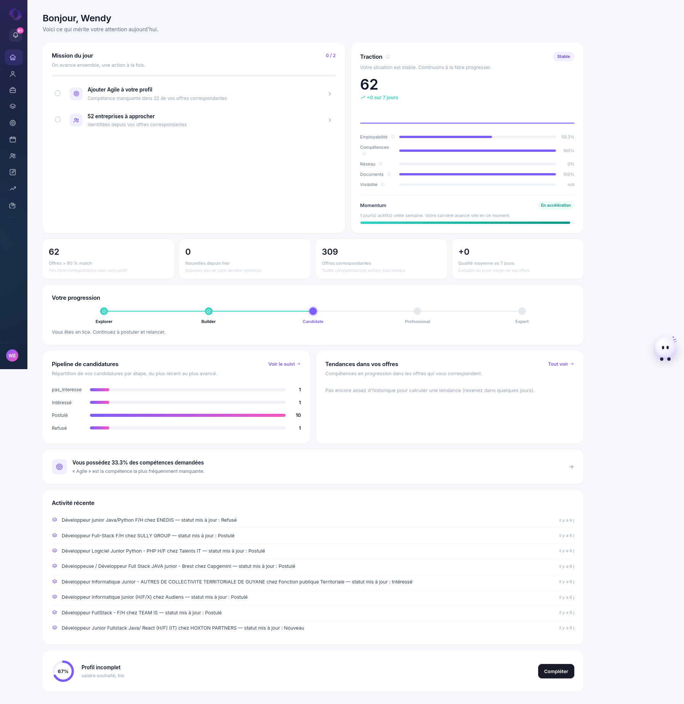
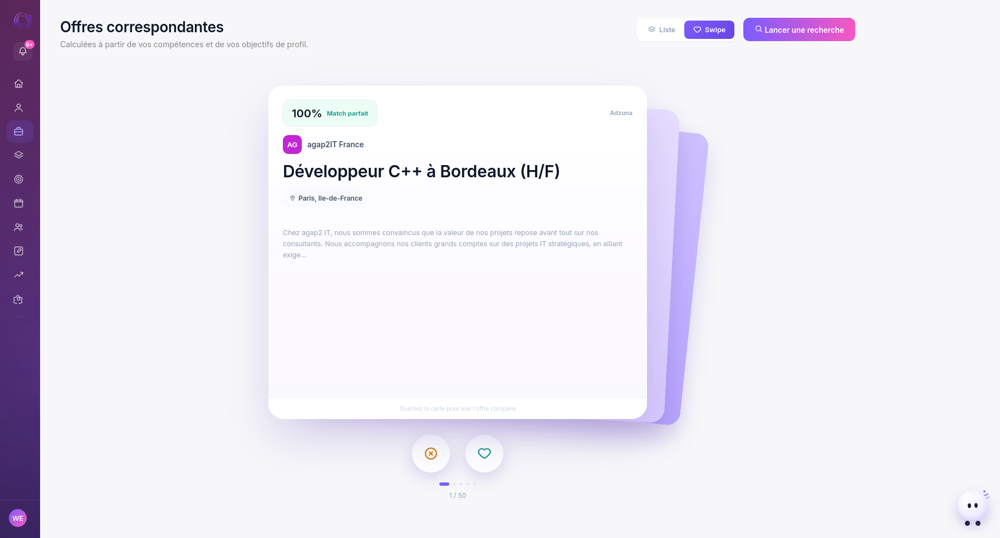
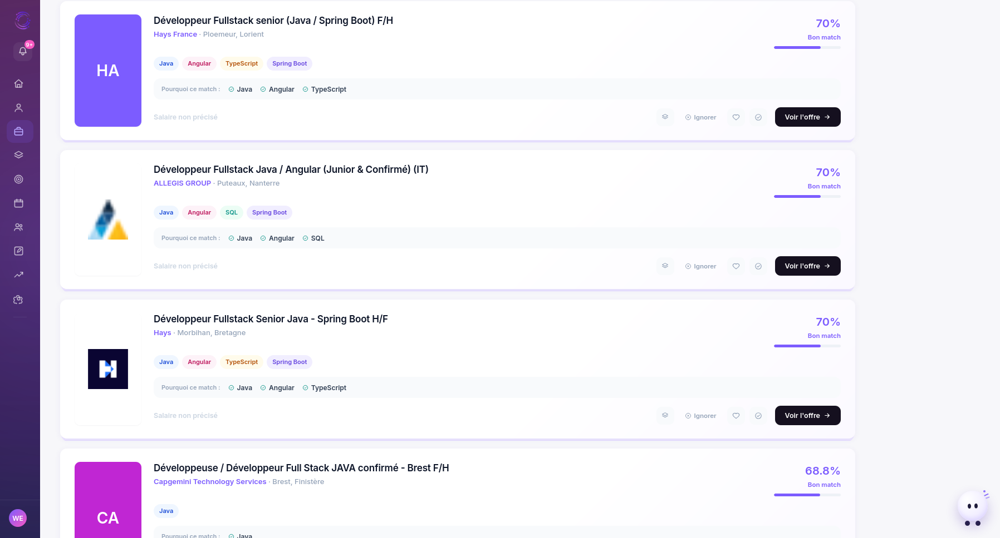
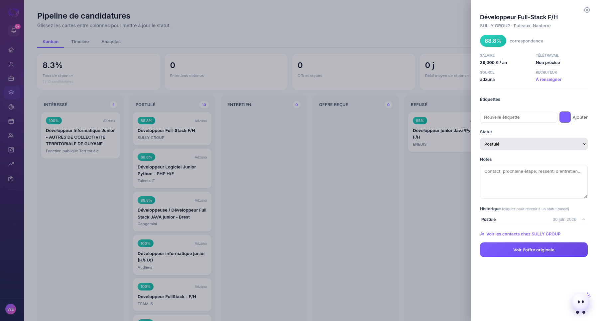
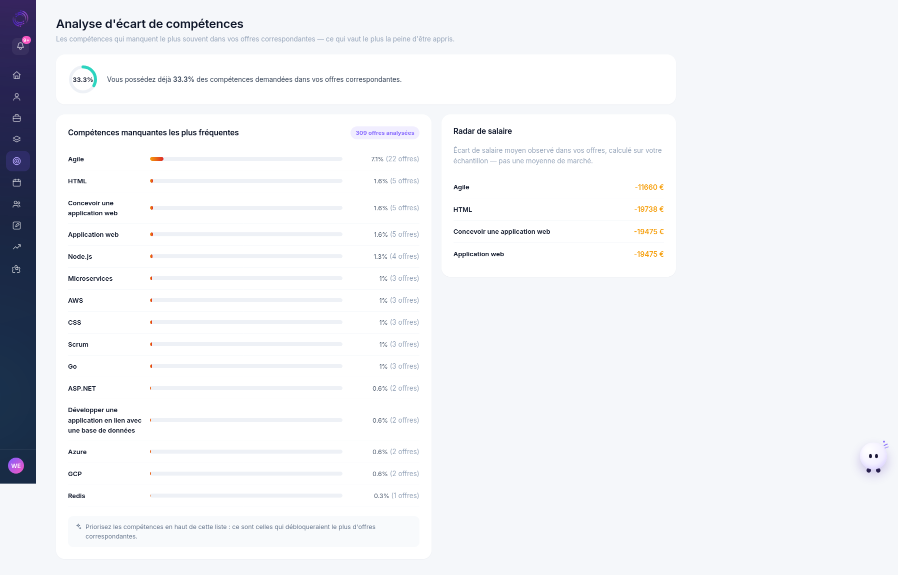
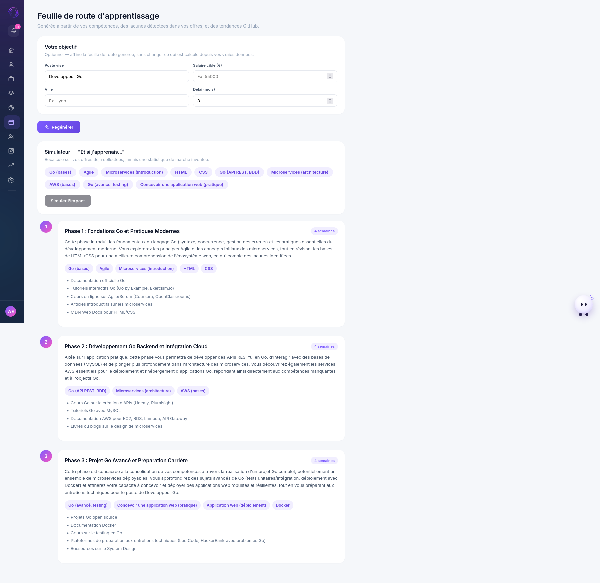
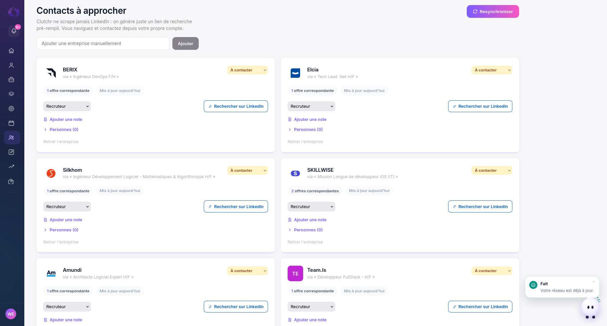
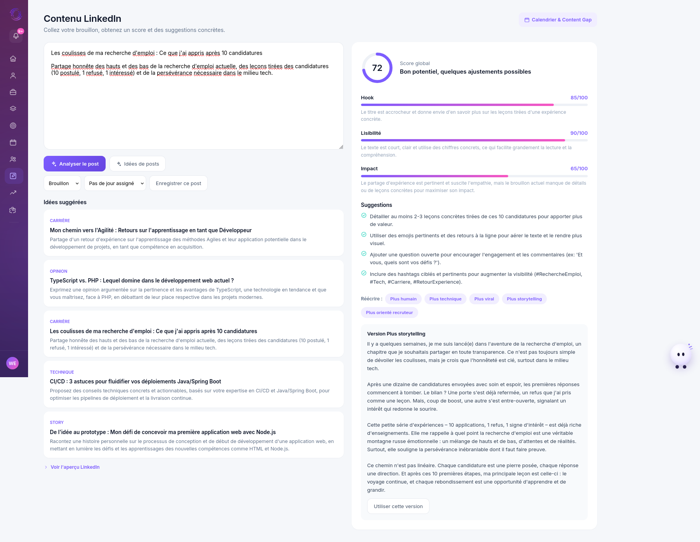
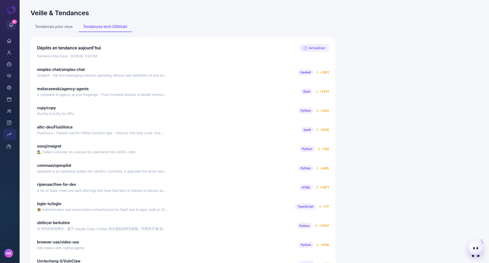

<div align="center">

# Clutchr

**Copilote de recherche d'emploi — SaaS full-stack développé en solo**

[](https://python.org)
[](https://djangoproject.com)
[](https://www.django-rest-framework.org)
[](https://angular.io)
[](https://typescriptlang.org)
[](https://ai.google.dev)

</div>

---

Clutchr remplace les tableurs de suivi de candidatures par un copilote actif : scraping multi-sources, moteur de scoring maison, pipeline Kanban, analyse d'écart de compétences, génération de roadmap et de contenu LinkedIn par IA. Toutes les métriques sont calculées depuis les données réelles de l'utilisateur — aucune statistique de marché externe n'est injectée.

---

## Stack

| Couche | Technologies |
|---|---|
| Backend | Django 4.2 · Django REST Framework 3.14 · SQLite (dev) / PostgreSQL (prod) |
| Frontend | Angular 16 standalone · TypeScript · PWA (Service Worker) |
| IA | Google Gemini 2.5 Flash — appels REST directs, pas de SDK |
| Scraping | Adzuna API · France Travail OAuth2 · GitHub Trending (HTML scraping) |
| Auth | DRF Token auth · Google OAuth 2.0 (Identity Services) · TOTP 2FA (pyotp) |
| Utilitaires | PyPDF2 · BeautifulSoup4 · YouTube Data API v3 · geo.api.gouv.fr |

---

## Architecture

```
clutchr/
├── backend/
│   ├── clutchr/                   # Configuration Django
│   │   ├── settings.py
│   │   └── urls.py
│   ├── jobs/                      # Application principale
│   │   ├── models.py              # 16 modèles, 20 migrations
│   │   ├── views.py               # 56 actions API (ModelViewSet + @action)
│   │   ├── serializers.py
│   │   ├── matching.py            # Moteur de scoring
│   │   ├── scraping_service.py    # Orchestration multi-sources
│   │   ├── content_ai.py          # Intégrations Gemini
│   │   ├── snapshots.py           # Career Pulse — calcul et historique
│   │   ├── momentum.py            # Vélocité d'activité
│   │   ├── dashboard_service.py   # Agrégation des métriques dashboard
│   │   └── auth_security.py       # TOTP, tokens 2FA, codes de secours
│   ├── scrapers/
│   │   ├── adzuna.py
│   │   ├── france_travail.py      # OAuth2 client credentials
│   │   └── github_trending.py     # HTML scraping (BeautifulSoup)
│   └── utils/
│       ├── pdf_parser.py          # Extraction texte PDF (PyPDF2)
│       ├── skill_extractor.py     # Détection de compétences par pattern matching
│       ├── geocoding.py           # Résolution ville → code INSEE (geo.api.gouv.fr)
│       └── youtube.py             # Ressources d'apprentissage via YouTube Data API
│
└── frontend/
    └── src/app/
        ├── core/
        │   ├── auth/              # AuthService · Token interceptor · Auth guard
        │   ├── notify/            # NotifyService · MascotComponent
        │   └── config.ts          # API_URL centralisé
        ├── shared/                # Sidebar · ClutchrLogoComponent · IconComponent
        └── features/              # 14 pages (lazy-loaded, standalone components)
```

### Modèles clés

| Modèle | Rôle |
|---|---|
| `UserProfile` | Extension de `auth.User` — compétences extraites, préférences, statut profil |
| `JobListing` | Offre normalisée toutes sources confondues (`source` + `source_id` comme clé naturelle) |
| `JobMatch` | Relation `UserProfile × JobListing` — score, statut Kanban, étiquettes, `viewed_at` |
| `JobMatchStatusEvent` | Historique immuable des changements de statut (source pour le Momentum) |
| `ScrapeCursor` | Curseur de pagination scopé par `(user, source, query_key)` — évite le reset global |
| `CareerPulseSnapshot` | Snapshot quotidien des 5 axes du Pulse pour le calcul de delta |

---

## Fonctionnalités principales

### Moteur de matching

Score calculé en 4 dimensions indépendantes :

- **Compétences** — intersection pondérée entre les compétences extraites du profil et celles détectées dans la description de l'offre par pattern matching
- **Localisation** — résolution `'remote' | 'match' | 'partial' | 'unknown'` depuis les villes cibles et le type de télétravail
- **Salaire** — comparaison fourchette offre vs fourchette cible : `'match' | 'below' | 'unknown'`
- **Expérience** — extraction de la plage d'années requise depuis la description, comparée aux années déclarées

Le score final est une moyenne pondérée des dimensions disponibles. Une dimension non renseignée ne pénalise pas le score global.

### Scraping et pagination

Le `ScrapeCursor` est scopé par combinaison `role|location` (pas par source globalement). Avant ce design, un seul booléen `exhausted` partagé entre toutes les requêtes d'une source bloquait la pagination dès qu'une combinaison de niche renvoyait moins que `PAGE_SIZE` résultats — ce qui se produisait systématiquement avec des recherches ciblées. Chaque combinaison avance maintenant indépendamment.

### Career Pulse vs Momentum

Deux métriques distinctes intentionnellement :

**Career Pulse** — score pondéré sur 5 axes statiques (employabilité 30%, compétences 25%, réseau 20%, documents 15%, visibilité 10%). Mesure la qualité du profil à un instant T. Snapshoté quotidiennement dans `CareerPulseSnapshot` pour le calcul de delta à 7 jours.

**Momentum** — calculé depuis les événements horodatés réels des 7 derniers jours (transitions de statut Kanban, contacts réseau, posts LinkedIn, missions complétées). Les transitions vers `interesse|postule|entretien|offre` sont pondérées plus fortement (×3) que les autres actions (×2). Le score est plafonné à 100 et ne stocke pas de points — il recalcule à chaque appel.

### Intégrations Gemini

Toutes les fonctions IA (`content_ai.py`) appellent directement l'API REST Gemini sans SDK intermédiaire. Les prompts structurés retournent du JSON parsé et validé côté serveur avant d'être renvoyés au frontend. En l'absence de `GEMINI_API_KEY`, les endpoints concernés retournent une erreur 501 explicite plutôt que de planter silencieusement.

Fonctions disponibles : analyse de post LinkedIn, reformulation 5 styles, génération d'idées de posts, roadmap d'apprentissage structurée, suggestions de rôles, structuration de profil depuis PDF, messages d'approche réseau, préparation d'entretien.

### Authentification

- Token DRF stateful (stocké en `localStorage`, injecté par intercepteur HTTP Angular)
- Google OAuth 2.0 via Identity Services — le `id_token` JWT est vérifié côté backend avec `google-auth`
- 2FA TOTP : génération de secret, QR code data URI, vérification via `pyotp`, codes de secours hashés
- Login 2FA en deux étapes : un token éphémère signé est émis après le premier facteur, échangé contre le token définitif après vérification TOTP
- `authGuard` Angular sur toutes les routes protégées (17 routes, 12 gardées)

---

## Screenshots

### Dashboard



---

### Offres correspondantes

<table>
<tr>
<td width="50%">



</td>
<td width="50%">



</td>
</tr>
<tr>
<td align="center">Mode Swipe</td>
<td align="center">Mode Liste</td>
</tr>
</table>

---

### Pipeline de candidatures



---

### Analyse d'écart de compétences



---

### Feuille de route d'apprentissage



---

### Réseau & Contacts



---

### Contenu LinkedIn



---

### Veille & Tendances



---

## Installation

### Prérequis

- Python 3.10+
- Node.js 18+

### Backend

```bash
cd backend
python3 -m venv venv && source venv/bin/activate
pip install -r requirements.txt
cp .env.example .env
python manage.py migrate
python manage.py runserver
```

### Frontend

```bash
cd frontend
npm install
npm start
```

Application sur `http://localhost:4200`, API sur `http://localhost:8000`.

### Variables d'environnement

```env
USE_SQLITE=True                     # SQLite en dev, PostgreSQL en prod

# Scraping (comptes gratuits)
ADZUNA_APP_ID=
ADZUNA_APP_KEY=
FRANCETRAVAIL_CLIENT_ID=
FRANCETRAVAIL_CLIENT_SECRET=

# IA — fonctionnalités dégradées gracieusement si absent (HTTP 501)
GEMINI_API_KEY=
GEMINI_MODEL=gemini-2.5-flash

# Auth sociale (optionnel)
GOOGLE_CLIENT_ID=

# Ressources d'apprentissage
YOUTUBE_API_KEY=
```

Le port de l'API est centralisé dans `frontend/src/app/core/config.ts` (`API_URL`) — un seul endroit à modifier pour pointer vers un environnement différent.

---

## API

Documentée automatiquement via `drf-spectacular` :

```
http://localhost:8000/api/docs/          # Swagger UI
http://localhost:8000/api/schema/        # OpenAPI JSON
```

56 actions exposées sur 9 ViewSets. Pagination `PageNumberPagination` (20 items/page) activée globalement.
